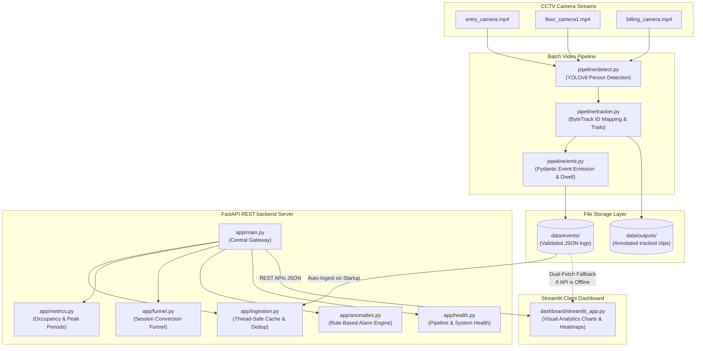

# Purplle Store Intelligence Challenge 🛍️
### Production-Ready CCTV Customer Journey & Spatial Retail Analytics Platform

This repository implements a modular, CPU-optimized, high-performance computer vision and retail analytics platform to capture customer footprints, track physical store journeys, evaluate sales funnel conversions, and flag anomalies across CCTV cameras.

---

## 🏗️ System Architecture

The diagram below details how CCTV telemetry moves through the platform's layers statefully:



---

## 🎯 Analytical Rules & Calculations

* **Persistent Tracking & Occlusion**: Integrates **YOLOv8** with **ByteTrack**. By setting `persist=True` and loading `bytetrack.yaml`, the pipeline uses Kalman filter state associations to preserve unique track IDs across frames and maintain ID continuity during temporary visual occlusions.
* **Journey Trajectory Trails**: Bounded rolling deques track the last `30` coordinates for each active customer. Smooth anti-aliased gradient trails are drawn on output frames to visualize journey footprints.
* **Stateful Event Emission**: `EventEmitter` checks coordinate tracks frame-by-frame. If a track ID is new, it triggers an `enter` event. If it persists, it posts `update` signals. If an ID is absent longer than `2000ms`, it registers an `exit` event and calculates total **Dwell Time** (Exit Time - Entry Time).
* **Store Conversion Funnel**:
  * **Stage 1 (Entrance)**: Mapped to `entry_camera` detections ( Awareness).
  * **Stage 2 (Browsing)**: Mapped to `floor_camera1`, `floor_camera2`, or `storage_area` ( Engagement).
  * **Stage 3 (Checkout)**: Mapped to `billing_camera` ( Purchase Conversion).
* **Rule-Based Anomalies**:
  * *Overcrowding*: Flags a zone bottleneck if occupancy exceeds local capacities (e.g. $>3$ in billing area, $>4$ in entrance foyer).
  * *Unusual Movement*: Bounding-box centroid displacements are evaluated frame-by-frame. Velocity exceeding `1.5` pixels/ms triggers a high-severity alert representing running or falls.
  * *Loitering*: Flags stay durations exceeding limits (e.g. $>45$s in lobbies, $>30$s in restricted rooms).
  * *Restricted Access*: Detections inside off-limits sectors (`storage_area`) instantly fire high-priority security alarms.

---

## 📂 Directory Layout

```
store-intelligence/
├── pipeline/
│   ├── detect.py      # Unified CLI Person Detector & ByteTrack Routing
│   ├── tracker.py     # Stateful Multi-Object Tracker & Gradient Motion Trails
│   ├── emit.py        # Pydantic Telemetry Schema Event Emitter & Dwell Calculator
│   └── run.sh         # Batch shell script runner to process all CCTV video feeds
├── app/
│   ├── main.py        # Central FastAPI REST API Gateway & Startup Restorer
│   ├── models.py      # Structured Pydantic v2 Ingestion and Analytics Schemas
│   ├── ingestion.py   # Thread-Safe In-Memory database, Ingest validation & Dedup
│   ├── metrics.py     # Aggregated KPIs, Peak Periods, and Traffic Rankers
│   ├── funnel.py      # Customer session builders & Stage conversion analytics
│   ├── anomalies.py   # Rule-based overcrowding, speed, loiter, & trespassing alarm engines
│   └── health.py      # FastAPI status diagnostics (Batch video progress & system metrics)
├── dashboard/
│   └── streamlit_app.py # Elegant Streamlit UI with Dual-Loading connection channels
├── data/
│   ├── videos/        # Input CCTV camera source clips (.mp4)
│   ├── outputs/       # Processed trajectory-annotated clips (_tracked.mp4)
│   ├── events/        # Validated telemetry event JSON archives
│   └── logs/          # Batch command console execution log dumps
├── requirements.txt   # Completely compatible, stable python dependency configurations
└── README.md          # Comprehensive architecture & execution guide
```

---

## ⚙️ Step-by-Step Execution Guide

### 1. Environment Setup
Execute the commands below inside a terminal to configure your localized environment and requirements:

```powershell
# Create standard Python Virtual Environment
python -m venv venv

# Activate Virtual Environment (Windows PowerShell)
.\venv\Scripts\Activate.ps1

# Activate Virtual Environment (Linux / macOS)
source venv/bin/activate

# Install compatible stable dependencies
pip install -r requirements.txt
```

### 2. Processing Video Feeds (Batch Camera Runner)
Place your CCTV `.mp4` video clips inside `data/videos/`. 
To run tracking statefully across all cameras in a single batch, execute the shell runner script:

```bash
# Run batch script (POSIX shell, Git Bash, or Linux container)
bash pipeline/run.sh
```

*The batch runner creates all required storage folders, binds to the virtual environment python interpreter, executes stateful tracking on each video, saves annotated clips to `data/outputs/`, writes events logs to `data/events/`, and archives console outputs inside `data/logs/`.*

### 3. Launching the Backend REST API Server
To boot the FastAPI central API gateway (which loads `/docs` Swagger screens and auto-ingests existing event JSONs on boot):

```powershell
# Spin up production server
uvicorn app.main:app --host 0.0.0.0 --port 8000 --reload
```

* **Swagger Interactive Playground**: [http://localhost:8000/docs](http://localhost:8000/docs)
* **ReDoc Specifications**: [http://localhost:8000/redoc](http://localhost:8000/redoc)
* **Liveliness Heartbeat Check**: `GET http://localhost:8000/health/live`
* **Process Progress Diagnostics**: `GET http://localhost:8000/health/status`

### 4. Booting the Client Analytics Dashboard
To open the front-end Streamlit control board:

```powershell
# Launch Streamlit client
streamlit run dashboard/streamlit_app.py
```

* **Visual Dashboard Link**: [http://localhost:8501](http://localhost:8501)

> [!NOTE]
> **Dual-Connection Channel**: The dashboard operates under two connection modes. If Uvicorn is active, it streams data from the REST API endpoints. If Uvicorn is offline, it automatically falls back to standalone mode, parsing JSON log outputs inside `data/events/` and running calculations on-the-fly inside the dashboard process.

---

## 🔌 API Endpoint Specifications

* `POST /api/ingest`: Accepts `CCTVBatchEvents` containing frame details. Performs schema validation and writes to the cache.
* `GET /api/analytics/summary`: Compiles global store KPIs: people counts, live active visitors, average stay times, timelines, and busiest cameras.
* `GET /api/analytics/funnel`: Generates stage progression counts, Drop-off Conversion rates, and completed vs. abandoned shopping times.
* `GET /api/analytics/active`: Isolates track IDs of currently active shoppers.
* `GET /api/analytics/anomalies`: Runs speed, loiter, trespassing, and crowding rules, returning a list of active `AnomalyNotification` structures.
* `GET /health/status`: Returns system resource grades, database latency, and video pipeline completion status.
