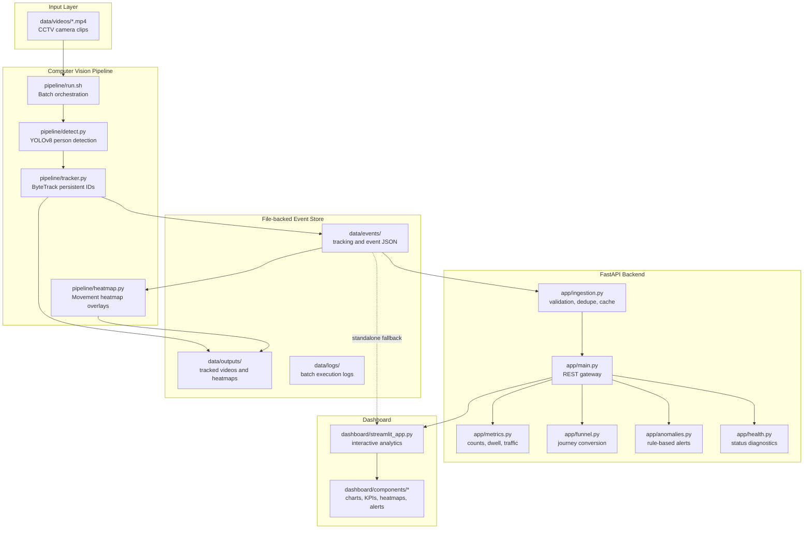
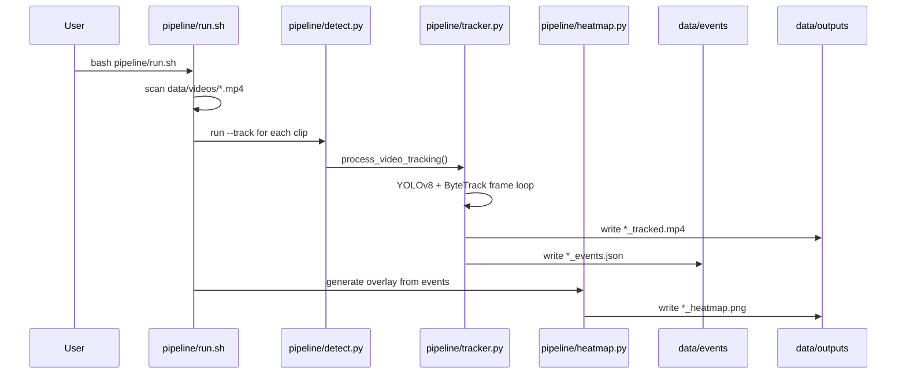
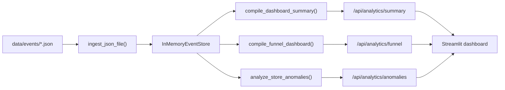

# Store Intelligence Architecture Design

## Purpose

Store Intelligence is a batch-oriented retail CCTV analytics platform. It converts
raw store camera clips into persistent customer tracks, structured telemetry
events, operational metrics, security alerts, spatial heatmaps, and dashboard
visualizations.

The system is intentionally modular:

- `pipeline/` handles computer vision processing and artifact generation.
- `app/` exposes analytics through a FastAPI service.
- `dashboard/` renders business-facing insights in Streamlit.
- `data/` is the local file-backed interchange layer for videos, events, logs,
  generated heatmaps, and processed clips.
- `docs/` explains the design and implementation trade-offs.

The current implementation is CPU-friendly by default and can run locally from
the command line. The same boundaries also map cleanly to Docker services:
pipeline worker, FastAPI backend, Streamlit dashboard, and shared volumes.

## High-Level Architecture



## Runtime Components

### Computer Vision Pipeline

The pipeline is the production of record for raw video-derived telemetry.

`pipeline/detect.py`

- Provides the unified CLI entry point for detection and tracking mode.
- Uses YOLOv8 to detect `person` class objects.
- In detection-only mode, writes annotated clips and detection JSON.
- In tracking mode, delegates to `pipeline/tracker.py`.

`pipeline/tracker.py`

- Wraps YOLOv8 `model.track(..., tracker="bytetrack.yaml", persist=True)`.
- Uses ByteTrack to assign persistent `track_id` values across frames.
- Stores rolling centroid history for trajectory trails.
- Writes frame-level telemetry to `data/events/<camera>_events.json`.
- Writes trajectory-annotated clips to `data/outputs/<camera>_tracked.mp4`.

`pipeline/emit.py`

- Provides an event-emitter abstraction for `enter`, `update`, and `exit`.
- Tracks active IDs in memory.
- Emits `exit` events when a track disappears beyond an occlusion timeout.
- Calculates dwell duration on exit.
- Uses Pydantic models for event structure validation.

`pipeline/heatmap.py`

- Reads tracking/event JSON.
- Extracts centroids from explicit `centroid` fields or bbox centers.
- Accumulates density with NumPy and smooths with OpenCV Gaussian blur.
- Blends thermal overlays onto CCTV frames.
- Saves heatmap images, and optionally heatmap overlay videos, under
  `data/outputs/`.

`pipeline/run.sh`

- Batch runner for every `.mp4` file in `data/videos/`.
- Creates `data/outputs`, `data/events`, and `data/logs`.
- Runs tracking for each camera.
- Generates heatmaps after successful tracking.
- Captures execution logs per source video.

### FastAPI Backend

The backend is a stateless service facade over an in-memory cache restored from
JSON files.

`app/main.py`

- Creates the FastAPI application.
- Restores telemetry from `data/events/*.json` on startup.
- Exposes analytics endpoints:
  - `POST /api/ingest`
  - `GET /api/analytics/summary`
  - `GET /api/analytics/funnel`
  - `GET /api/analytics/active`
  - `GET /api/analytics/anomalies`
  - `GET /health/live`
  - `GET /health/status`

`app/ingestion.py`

- Loads event JSON from disk.
- Supports event-list and frame-log formats.
- Normalizes tracker output into standard event payloads.
- Validates records with Pydantic.
- Deduplicates by `(camera_id, track_id, timestamp, event_type)`.
- Stores events in a thread-safe in-memory list.

`app/models.py`

- Defines core API schemas:
  - `CCTVEventPayload`
  - `CCTVBatchEvents`
  - analytics response models
  - `AnomalyNotification`
  - health/status models

`app/metrics.py`

- Computes people counts, active occupancy, dwell analytics, peak traffic,
  camera rankings, customer trajectories, and high-engagement zones.

`app/funnel.py`

- Reconstructs customer sessions from track events.
- Maps camera IDs into retail funnel stages.
- Computes conversion rates and abandoned journeys.

`app/anomalies.py`

- Runs rule-based security and operational anomaly detectors:
  - overcrowding
  - unusual movement
  - long idle duration
  - restricted zone access

`app/health.py`

- Provides liveliness and diagnostic routes.
- Checks processed video/event artifacts against input videos.
- Reports in-memory ingestion state and lightweight resource estimates.

### Streamlit Dashboard

The dashboard is both API-backed and resilient in standalone mode.

`dashboard/streamlit_app.py`

- Checks FastAPI availability via `/health/live`.
- If the API is online, fetches analytics from REST endpoints.
- If the API is offline, loads local JSON from `data/events/` and runs the same
  analytics functions in process.
- Supports camera filtering and confidence filtering.
- Recomputes analytics when filters change.

Dashboard components:

- `kpi_cards.py`: total customers, active occupancy, dwell, busiest zone, status.
- `charts.py`: funnel chart, dwell histogram, camera workload table.
- `heatmap.py`: generated heatmap image display with matplotlib fallback.
- `anomaly_table.py`: security and anomaly alert rendering.
- `selectors.py`: sidebar filters and status indicators.

## Pipeline Flow

### Batch Processing Flow



### Per-Frame Tracking Flow

1. Open video with OpenCV `VideoCapture`.
2. Read frame metadata: width, height, FPS, frame count.
3. Run YOLOv8 ByteTrack on each frame.
4. Parse each detection:
   - `track_id`
   - `[x1, y1, x2, y2]`
   - centroid
   - confidence
   - normalized bbox coordinates
5. Append frame telemetry to a JSON-ready log.
6. Draw boxes, IDs, and motion paths on the frame.
7. Write annotated output frame.
8. Persist final telemetry JSON after the video completes.

## Event-Driven Design

The project uses JSON telemetry as its event boundary. This keeps the computer
vision layer decoupled from the API and dashboard layers.

### Why JSON Events

- Easy to inspect during development.
- Durable across process restarts.
- Works without a database.
- Enables offline batch processing.
- Can be replaced later by object storage, a queue, or a database without
  rewriting analytics logic.

### Event Shapes

Frame-level tracker output:

```json
{
  "metadata": {
    "timestamp": "2026-05-30 18:00:00",
    "total_frames_processed": 1200,
    "total_unique_customers": 42,
    "tracking_algorithm": "YOLOv8-ByteTrack"
  },
  "frames": [
    {
      "frame_index": 1,
      "timestamp_ms": 40.0,
      "active_count": 2,
      "detections": [
        {
          "track_id": 7,
          "bbox": [100, 150, 180, 330],
          "bbox_normalized": [0.05, 0.13, 0.09, 0.31],
          "centroid": [140, 240],
          "confidence": 0.91
        }
      ]
    }
  ]
}
```

Standard analytics event payload:

```json
{
  "timestamp": 500.0,
  "camera_id": "entry_camera",
  "track_id": 7,
  "bbox": [100, 150, 180, 330],
  "confidence": 0.91,
  "event_type": "update",
  "dwell_time_sec": null
}
```

The ingestion layer accepts both formats. Frame-level tracker detections are
converted into standard `update` events when loaded into the backend cache.

## Tracking Architecture

YOLOv8 provides object detections. ByteTrack provides temporal identity
association. The project uses both through Ultralytics tracking mode:

```python
model.track(
    source=frame,
    persist=True,
    classes=[0],
    tracker="bytetrack.yaml",
    device="cpu"
)
```

Key design points:

- `classes=[0]` restricts inference to people.
- `persist=True` keeps tracker state across frames.
- ByteTrack recovers identity through short occlusions by associating detections
  over time.
- The pipeline stores both pixel and normalized coordinates. Pixel coordinates
  power drawing, heatmaps, and anomaly speed checks. Normalized coordinates make
  downstream use less dependent on camera resolution.
- `track_history` stores a short rolling path for visual trails. This is not the
  durable event store; the JSON output is.

Failure handling:

- Missing input video paths raise `FileNotFoundError`.
- Unopenable streams raise `IOError`.
- Fast test or CPU runs guard elapsed-time divisions.
- Detection coordinates are normalized to Python primitives before JSON output.
- Malformed event-emitter payloads raise clear `ValueError` exceptions.

## Analytics Flow



### Core Metrics

`app/metrics.py` computes:

- total unique customers
- active visitors
- per-customer dwell time
- dwell distribution buckets
- peak traffic windows
- camera workload rankings
- customer trajectories
- zone engagement scores

Dwell analytics prefer explicit `exit.dwell_time_sec` when available and fall
back to observed timestamp span when only update events exist.

### Funnel Analytics

`app/funnel.py` maps cameras to retail stages:

| Camera | Stage |
| --- | --- |
| `entry_camera` | `1_Entrance` |
| `floor_camera1`, `floor_camera2`, `storage_area` | `2_Browsing` |
| `billing_camera` | `3_Checkout` |

The funnel engine reconstructs sessions per `track_id`, records camera
sequence, identifies completed purchases, and computes:

- entrance to browse rate
- entrance to checkout rate
- browse to checkout efficiency
- abandoned journeys
- average completed and abandoned session duration

### Anomaly Analytics

`app/anomalies.py` uses deterministic rules:

- Overcrowding: unique tracks exceed zone capacity within a time bin.
- Unusual movement: centroid velocity exceeds `1.5 px/ms`.
- Long idle duration: per-zone dwell exceeds configured limits.
- Restricted access: any track appears in `storage_area`.

This rule-based design is explainable and easy to tune. It is also safe for
retail operations where false positives should be understandable and auditable.

## Heatmap Flow

Spatial heatmaps are generated after tracking:

1. Load tracking JSON from `data/events/`.
2. Extract centroid from each detection or compute bbox center.
3. Accumulate points into a `float32` NumPy density map.
4. Smooth density with OpenCV Gaussian blur.
5. Normalize and colorize with an OpenCV colormap.
6. Alpha-blend active regions onto a CCTV frame.
7. Save image to `data/outputs/<camera>_heatmap.png`.

The dashboard first checks for pre-generated heatmap images. If none exist, it
falls back to plotting available event coordinates.

## Data Storage Strategy

The project currently uses local files as the durable layer:

```text
data/
  videos/      input CCTV clips
  outputs/     tracked videos and heatmap images
  events/      JSON telemetry
  logs/        batch runner logs
```

This is appropriate for a challenge project and local demonstration because it
keeps the system inspectable. For production deployment, the same logical
boundaries can move to:

- object storage for videos and generated artifacts
- PostgreSQL or ClickHouse for events and metrics
- Redis for active occupancy cache
- Kafka, RabbitMQ, SQS, or Pub/Sub for event streaming
- Prometheus/Grafana for service metrics

## Deployment Model

The repository includes a `docker-compose.yml` placeholder. The architecture is
already split in a way that supports container deployment, even though the local
workflow is command-driven.

Recommended Docker service boundaries:

```yaml
services:
  pipeline-worker:
    command: bash pipeline/run.sh
    volumes:
      - ./data:/app/data

  api:
    command: uvicorn app.main:app --host 0.0.0.0 --port 8000
    ports:
      - "8000:8000"
    volumes:
      - ./data:/app/data

  dashboard:
    command: streamlit run dashboard/streamlit_app.py
    ports:
      - "8501:8501"
    volumes:
      - ./data:/app/data
```

Important deployment considerations:

- Use `opencv-python-headless` in containers to avoid GUI dependencies.
- Mount `data/` as a shared volume between worker, API, and dashboard.
- Keep model weights in an image layer or a persistent cache volume.
- Run the pipeline worker separately from the API to avoid blocking HTTP
  service availability during long video processing.
- For GPU deployments, build an image with CUDA-compatible PyTorch and set the
  pipeline `--device cuda`.

## Scalability Considerations

### Current Strengths

- Computer vision, analytics, API, and dashboard are separated.
- JSON files create a durable boundary between batch jobs and serving.
- Analytics functions are pure enough to test with mock events.
- CPU execution is the default, which makes local and container execution
  predictable.
- FastAPI can restart and restore state from event JSON.
- Streamlit can operate even if FastAPI is offline.

### Scaling Video Processing

The highest-cost workload is YOLOv8 inference. Scaling options:

- Process each camera file independently in parallel workers.
- Use GPU acceleration for high-frame-count clips.
- Sample frames for lower-latency approximate analytics.
- Split long videos into chunks and merge track/event outputs by source.
- Push completed event files to object storage and notify ingestion through a
  queue.

### Scaling Analytics

The current in-memory store is simple and fast for small to medium batches. At
larger scale:

- Move raw events into a database.
- Pre-aggregate common metrics by camera and time bucket.
- Cache dashboard summary responses.
- Use streaming updates for active occupancy and alerts.
- Store heatmap density arrays instead of regenerating from all events.

### Scaling the Dashboard

Streamlit is suitable for internal operations dashboards. For larger user bases:

- Keep Streamlit as an internal analyst UI, or
- Build a separate web frontend over the same FastAPI endpoints, and
- Add authentication and role-based access to the API.

## AI-Assisted Engineering Decisions

The implementation reflects several AI-assisted engineering choices intended to
improve maintainability without overcomplicating the project:

- Preserve architecture: changes were added to existing modules rather than
  introducing unrelated frameworks or storage systems.
- Prefer reusable pure functions: metrics, funnel, anomaly, and heatmap logic
  can be tested without running full video inference.
- Keep model inference mockable: tests validate pipeline glue without requiring
  model downloads or GPU hardware.
- Keep outputs human-inspectable: JSON events and image/video artifacts are easy
  to review during debugging.
- Favor deterministic analytics: business rules are explainable and tunable.
- Optimize for CPU first: OpenCV and NumPy are used for image and density work,
  while YOLO runs on `cpu` unless configured otherwise.
- Add failure-oriented tests: invalid video paths, malformed event payloads,
  serialization issues, empty inputs, and threshold boundaries are covered.

## Testing Strategy

The test suite validates the architecture at module boundaries:

- detection pipeline with mocked YOLO output
- tracker parsing with ByteTrack-like mock output
- event emitter state transitions
- heatmap density and overlay generation
- people count and dwell metrics
- funnel conversion analytics
- anomaly rule families and edge cases

Tests use reusable fixtures in `tests/conftest.py` and avoid heavyweight model
inference. This keeps the suite fast while still verifying the contracts between
modules.

## Operational Workflow

1. Place CCTV clips in `data/videos/`.
2. Run `bash pipeline/run.sh`.
3. Confirm artifacts in:
   - `data/events/`
   - `data/outputs/`
   - `data/logs/`
4. Start API:

```bash
uvicorn app.main:app --host 0.0.0.0 --port 8000 --reload
```

5. Start dashboard:

```bash
streamlit run dashboard/streamlit_app.py
```

6. Use `/health/status` to inspect processing state and ingestion state.

## Known Limitations

- The default storage layer is file-backed, not database-backed.
- The in-memory event store resets on process restart and restores from disk.
- Cross-camera identity continuity depends on track IDs produced per source; a
  production multi-camera deployment would need a global re-identification
  strategy if cameras overlap or customers move between independent streams.
- Current anomaly rules are deterministic thresholds, not learned behavior
  models.
- `docker-compose.yml` is currently a placeholder; the service boundaries are
  documented above for containerization.
- Authentication and authorization are not implemented in the API.

## Summary

Store Intelligence is organized around a clean telemetry lifecycle:

```text
CCTV video -> detections -> persistent tracks -> JSON events -> analytics ->
API responses -> dashboard views
```

The architecture favors inspectability, modularity, and CPU-friendly execution.
It is small enough to run locally, but its boundaries are clear enough to scale
into separate worker, API, storage, and dashboard services.
